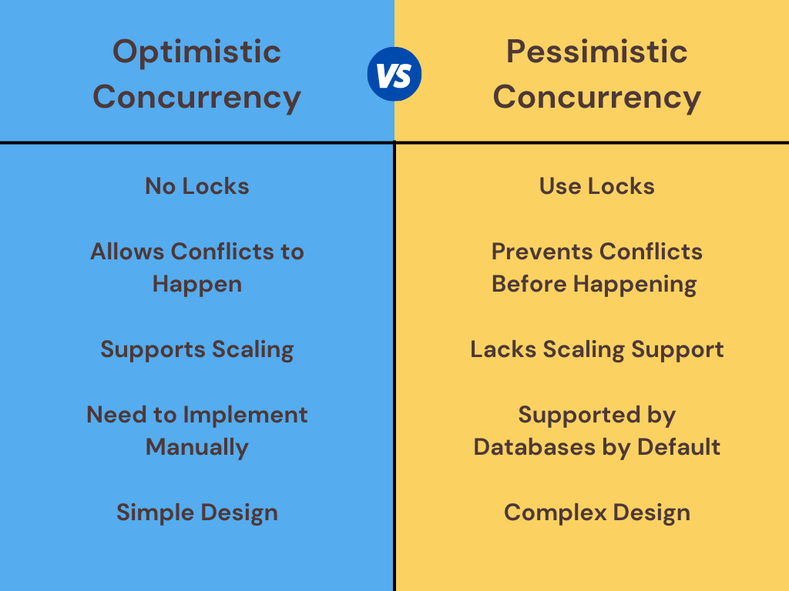
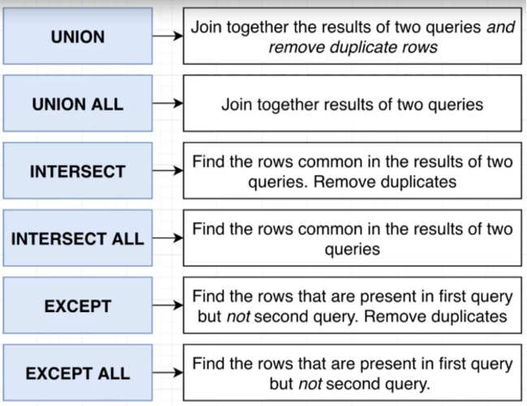

# MyISAM vs. InnoDB:
- **MyISAM:**
  - B-tree (balanced tree) indexes point to the rows directly (no primary key!).
  - No transaction support.
  - Table-level locking.
  - Inserts are fast but updates and deletes are problematic.
  - Database crashes corrupt tables (need to manually repair).
  - Used to be the default engine for MySQL.
- **InnoDB:**
  - B+tree (indexes point to primary key and PK points to row).
  - ACID compliant transactions support.
  - Row-level locking.
  - Supports referential integrity involving foreign keys (RDBMS) and relationship constraints.
  - More reliable as it uses transactional logs for auto recovery.
  - Replaces MyISAM and now it’s the default for MySQL & MariaDB.
- **Resources:**
  - [Hussein Fundamentals of Database Engineering Course](https://www.udemy.com/course/database-engines-crash-course/)
  - [Kinsta](https://kinsta.com/knowledgebase/convert-myisam-to-innodb/)
# Read phenomena:
- **Lost updates:** When 2 transactions modify the same data, potentially resulting in the loss of one of the updates.
- **Serialization anomaly:**
  - The result of successfully committing a group of transactions is inconsistent with all possible orderings of running those transactions one at a time.
  - Example:
    - I want to subtract $50 from Tom's account if he has enough money.
    - I open a transaction, run a SELECT statement, and realize that he has $100.
    - At this very moment, someone subtracts $60 from Tom's balance and commits immediately.
    - Since I've checked that Tom got $100, I proceed to subtract $50 from this account.
    - Now, his on-disk balance value is -$10, which is an inconsistent state.
- **Resources:**
  - [PostgreSQL Documentation](https://www.postgresql.org/docs/current/transaction-iso.html)
  - [Dev.to Article](https://dev.to/tlphat/repeatable-read-consistent-read-and-serialization-anomaly-4eln)
# Concurrency Control:
- **Optimistic Concurrency:**
  - Considers the best scenario when handling concurrency.
  - Assumes conflicts between transactions will happen infrequently.
  - Allows transactions to happen in an unsynchronized manner without any interference.
  - Checks for conflicts between transactions right before changes are committed to the DB.
  - If there are any conflicts, the user will interfere and complete the transactions manually.
  - **Pros:**
    - Doesn’t require locks.
    - No deadlock situations.
    - Does not affect performance.
    - Offers support to scale apps.
  - **Cons:**
    - Requires maintenance of versions/timestamps.
    - Requires manual implementation of concurrency handling logic.

- **Pessimistic Concurrency:**
  - Opposite of optimistic as it assumes conflicts between transactions can happen often.
  - Blocks data records as the user starts to update, so other users will not be able to update the same data until the lock is released.
  - Lock types:
    - Shared: allows other users to read the data record; they can’t update it.
    - Exclusive: only the user who applied the lock can read or update the data.
    - Update: similar to exclusive locks but can be applied when another user already has a shared lock.
  - **Pros:**
    - Built-in database support.
    - Prevents conflicts.
  - **Cons:**
    - Performance issues if the lock duration is high.
    - Deadlock situation can happen.
    - Affects app scalability.
    - Not supported by all DBs.
    - High resource consumption due to locking and waiting.

- **Resource:** [Cult.honeypot](https://cult.honeypot.io/reads/optimistic-vs-pessimistic-concurrency/)
# Normalization:
- **First Normal Form Rules (NF1):**
  - Using row order to convey info is not permitted.
  - Mixing data types within the same column is not permitted.
  - Having a table without a primary key is not permitted.
  - Repeating groups are not permitted.
- **First Normal Form Rules (NF2):**
  - No partial dependency: each non-key attribute must depend on the entire primary key.
- **First Normal Form Rules (NF3):**
  - No transitive dependency: non-key attribute must not depend on other non-key attributes.
- **Resource:** [Decomplexify](https://www.youtube.com/watch?v=GFQaEYEc8_8)
# INTERSECT & EXCEPT:

- **Resource:** [Stephen Grider Course](https://www.udemy.com/course/sql-and-postgresql/)
