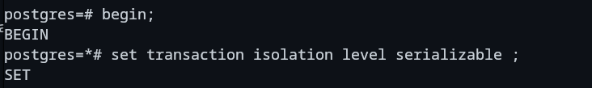
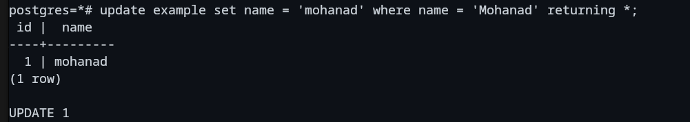
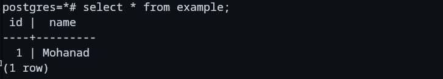
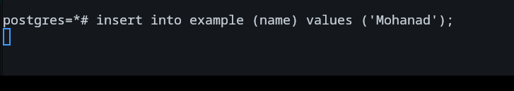

### Concurrency always has a lot of problems .. Let's list one of them and how PostgreSQL handles this

## Technically in a perfect world we would want two concurrent transactions to act as if they were sequential so no two transactions would be dependant on each other

---

## For example let's assume we created a table on a single instance in which the ``name`` column is a `` UNIQUE NOT NULL`` column


## And now let's start two concurrent transactions using two different PostgreSQL instances AND dont forget to change the isolation level to ```Serializable``` for both instances "Will go by pg1 and pg2 to identify both instances"

### pg1
 
### pg2


## Now there are two concurrent transactions which are not committed yet

## In pg1 let's update the name ``Remember the names in this table should be unique``
### pg1 ... Updated successfully 


## BUT in pg2 AFTER we have updated the table in pg1 .. since we are in the highest level of isolation possible .. Serialization level avoids phantom read so we will not be able to see this change .. yet


## What if we try to insert a new row in pg2 with the name "Mohanad" which had just been updated by pg1 ?
### pg3

## You will notice that this instance got blocked .. since pg1 has not committed yet 

### pg1(left) .. pg2(right) Let's commit now in pg1 and see what will happen


## pg2 shot an error due to the conflict that had just happened as for this transaction it did not notice there was an update until the commit from the updated transaction was done so the solution is to just rollback pg2 and reinsert again


## Conclusion .. This ensures that no matter how many transactions are updating/deleting/inserting and violating some other constraints .. they will always act as if they were sequential not concurrent
